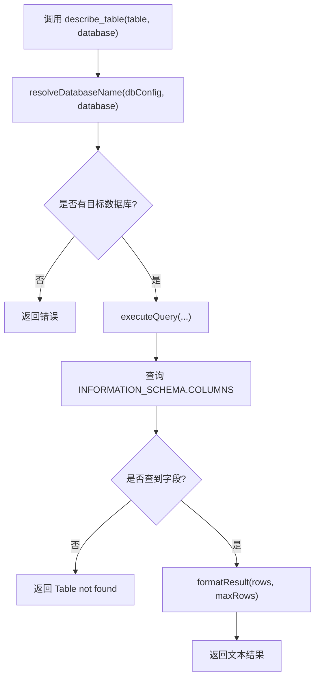

# describe_table Tool 说明

这份笔记专门介绍 [describe-table-tool.js](/Users/xiaolongxia/Desktop/AI/db-readonly-mcp/src/tools/describe-table-tool.js) 这个新增的 `describe_table` tool：它为什么适合作为第二个教程案例、它接收哪些参数、内部怎么实现。

配合 [[mcp-tool-and-zod-guide]] 和 [[index-method-call-flow]] 一起看会更完整。

> [!tip]
> 如果把 `query` 看成“通用型工具”，那 `describe_table` 就是“语义型工具”。
> 它只做一件事，所以特别适合拿来教学。

## 为什么选它做第二个 tool

我推荐它，主要是因为它同时满足三件事：

1. 实用
   让 AI 查表结构，是开发里非常常见的需求。

2. 简单
   它只需要两个参数：`table` 和可选的 `database`。

3. 好讲解
   它能清楚展示“一个 MCP tool 如何围绕单一业务意图来设计”。

## Tool 定义

当前注册代码核心结构如下：

```js
server.registerTool(
  "describe_table",
  {
    title: "Describe MySQL Table",
    description:
      "Show the schema of a MySQL table, including column names, types, nullability, keys, defaults, extras, and comments.",
    inputSchema: {
      table: z.string().min(1).describe("Table name to inspect."),
      database: z
        .string()
        .min(1)
        .optional()
        .describe("Optional database name to override DB_NAME for this request."),
    },
    annotations: {
      readOnlyHint: true,
      destructiveHint: false,
      idempotentHint: true,
      openWorldHint: false,
    },
  },
  async ({ table, database }) => {
    // ...
  }
);
```

## 参数说明

| 参数 | 类型 | 是否必填 | 作用 |
| --- | --- | --- | --- |
| `table` | `string` | 必填 | 你要查看结构的表名 |
| `database` | `string` | 可选 | 本次调用临时覆盖默认数据库 |

### 参数设计上的考虑

- `table` 设成必填，是因为这个 tool 的目标很明确，不传表名就没有意义。
- `database` 设成可选，是为了兼容两种场景：
  - 已经在 `.env` 里设置了 `DB_NAME`
  - 没设默认库，但希望调用时临时指定

## 内部执行流程



## 为什么这里不用 `DESCRIBE table_name`

虽然 `DESCRIBE users` 也能拿到字段信息，但这里我选的是查询 `INFORMATION_SCHEMA.COLUMNS`，主要有几个考虑：

1. 更安全
   可以通过参数占位符传 `TABLE_SCHEMA` 和 `TABLE_NAME`，不用手动拼接标识符。

2. 更稳定
   它对“显式指定数据库”和“临时覆盖默认数据库”这种场景更自然。

3. 返回更完整
   除了字段名和类型，还可以顺手带上：
   - 是否可空
   - 键类型
   - 默认值
   - 额外属性
   - 字段注释

## 实际查询的 SQL

```sql
SELECT
  COLUMN_NAME AS column_name,
  COLUMN_TYPE AS column_type,
  IS_NULLABLE AS is_nullable,
  COLUMN_KEY AS column_key,
  COLUMN_DEFAULT AS column_default,
  EXTRA AS extra,
  COLUMN_COMMENT AS column_comment
FROM INFORMATION_SCHEMA.COLUMNS
WHERE TABLE_SCHEMA = ? AND TABLE_NAME = ?
ORDER BY ORDINAL_POSITION
```

这条 SQL 的作用就是把一张表的列信息按原始字段顺序读出来。

## 返回结果长什么样

正常情况下，它会返回文本格式的 JSON 数组，类似：

```json
[
  {
    "column_name": "id",
    "column_type": "bigint(20)",
    "is_nullable": "NO",
    "column_key": "PRI",
    "column_default": null,
    "extra": "auto_increment",
    "column_comment": "primary key"
  }
]
```

如果表不存在，会返回错误文本：

```text
Table not found: your_database.your_table
```

如果没有可用数据库，也会返回错误文本：

```text
Rejected: database is required for describe_table when DB_NAME is not configured.
```

## 它为什么比 `query` 更适合做教程

> [!example]
> `query` 是一个“万能入口”  
> `describe_table` 是一个“明确能力块”

`query` 很强，但它太通用，教学时容易让人把关注点放在 SQL 本身。  
`describe_table` 则更像一个真正产品化的 MCP tool：

- 名字清晰
- 参数少
- 职责单一
- 输出预期稳定

所以它更适合帮助人理解：

- tool 名字应该怎么取
- schema 应该怎么收敛
- 为什么要把一个 MCP server 拆成多个语义明确的小工具

## 后续可以怎么继续扩

如果你想顺着这条路继续扩，最自然的几个方向是：

- `list_tables`
  列出某个数据库下的所有表

- `show_create_table`
  返回建表 SQL

- `list_indexes`
  返回某张表的索引信息

这些 tool 都可以沿用 `describe_table` 这种模式：

1. 参数尽量少
2. 业务意图尽量单一
3. schema 尽量清晰
4. 共用数据库执行 helper

## 相关笔记

- [[mcp-tool-and-zod-guide]]
- [[index-method-call-flow]]
