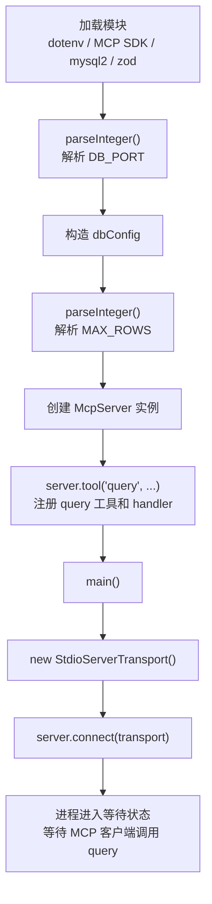
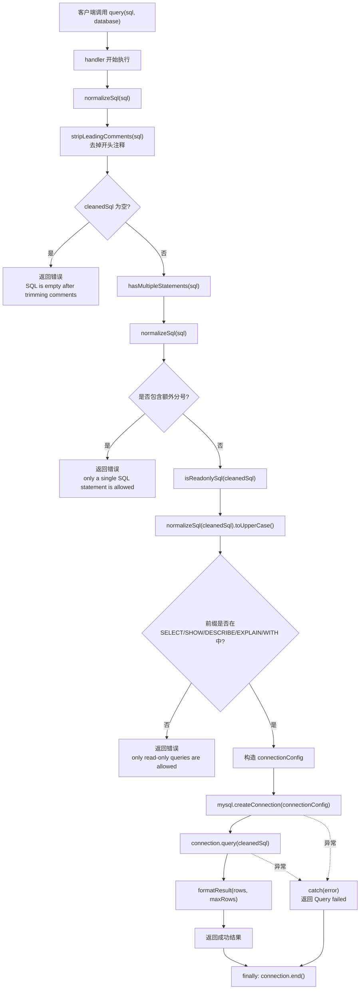
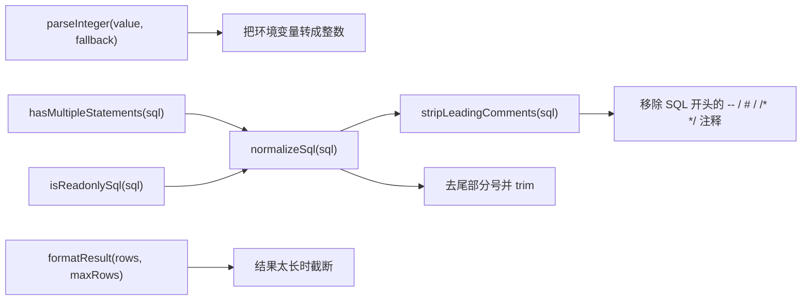

# `index.js` 方法调用流程图

这份文档专门解释 [index.js](/Users/xiaolongxia/Desktop/AI/db-readonly-mcp/index.js) 里的主要方法是怎么串起来工作的。

## 总览

这个文件的调用可以分成两段：

1. 启动阶段：读取环境变量，初始化配置，注册 `query` tool，建立 `stdio` 通信。
2. 查询阶段：当客户端调用 `query` 时，先做 SQL 清洗和安全校验，再连 MySQL 执行查询，最后格式化结果并返回。

## 启动阶段

## 查询阶段

## 工具函数关系

## 逐个方法看职责

- `parseInteger(value, fallback)`
  把 `.env` 里的字符串端口、行数限制转成整数；解析失败时回退到默认值。

- `stripLeadingComments(sql)`
  把 SQL 最前面的注释剥掉，避免 `-- comment` 或 `/* ... */` 影响后面的安全判断。

- `normalizeSql(sql)`
  先调用 `stripLeadingComments()`，再去掉尾部多余分号和空白。这个函数是后续校验的基础。

- `hasMultipleStatements(sql)`
  基于 `normalizeSql()` 的结果检查内部是否还有分号；有的话就认为可能是多语句，直接拒绝。

- `isReadonlySql(sql)`
  基于 `normalizeSql()` 的结果判断 SQL 是否以允许的只读前缀开头。

- `formatResult(rows, maxRows)`
  把查询结果转成 JSON 文本；如果结果行数太多，只返回前 `maxRows` 行并追加截断提示。

- `server.tool("query", ..., handler)`
  这是整个业务入口。客户端真正调用的是这里注册的 `query` tool，后面的 SQL 清洗、校验、数据库连接、结果返回都在这个 handler 里发生。

- `main()`
  只负责创建 `StdioServerTransport` 并把 server 接上去，让这个进程可以通过 `stdin/stdout` 跟 MCP 客户端通信。

## 你看代码时可以抓住的主线

最值得记的一条主线其实很简单：

`main()` 启动服务  
`server.tool()` 暴露能力  
`handler` 接请求  
`normalizeSql / hasMultipleStatements / isReadonlySql` 做安全校验  
`mysql.createConnection + query` 执行数据库操作  
`formatResult` 整理结果  
`finally` 负责收尾关闭连接

## 为什么我把图放在 `docs/`

- 这是实现说明，不是运行入口，放在 `docs/` 比放根目录更清晰。
- 后面如果你继续加 `list_tables`、`describe_table`、`resources`，可以继续把更多流程图放进同一个目录。
- `README.md` 保持“怎么运行”，`docs/` 负责“怎么理解”，职责更分明。
